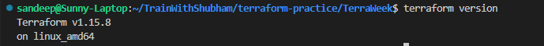
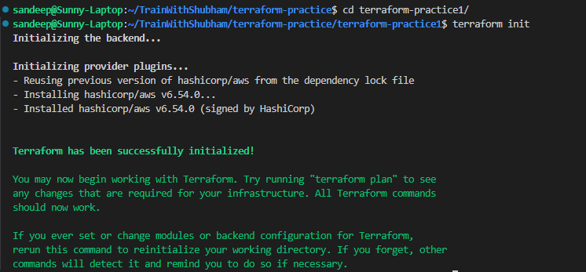
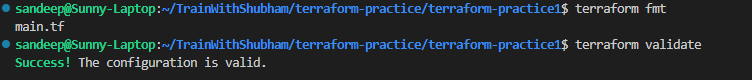
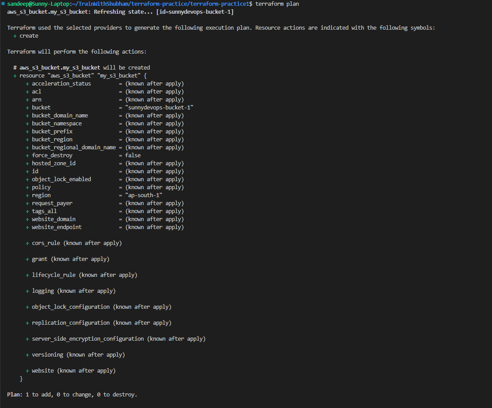
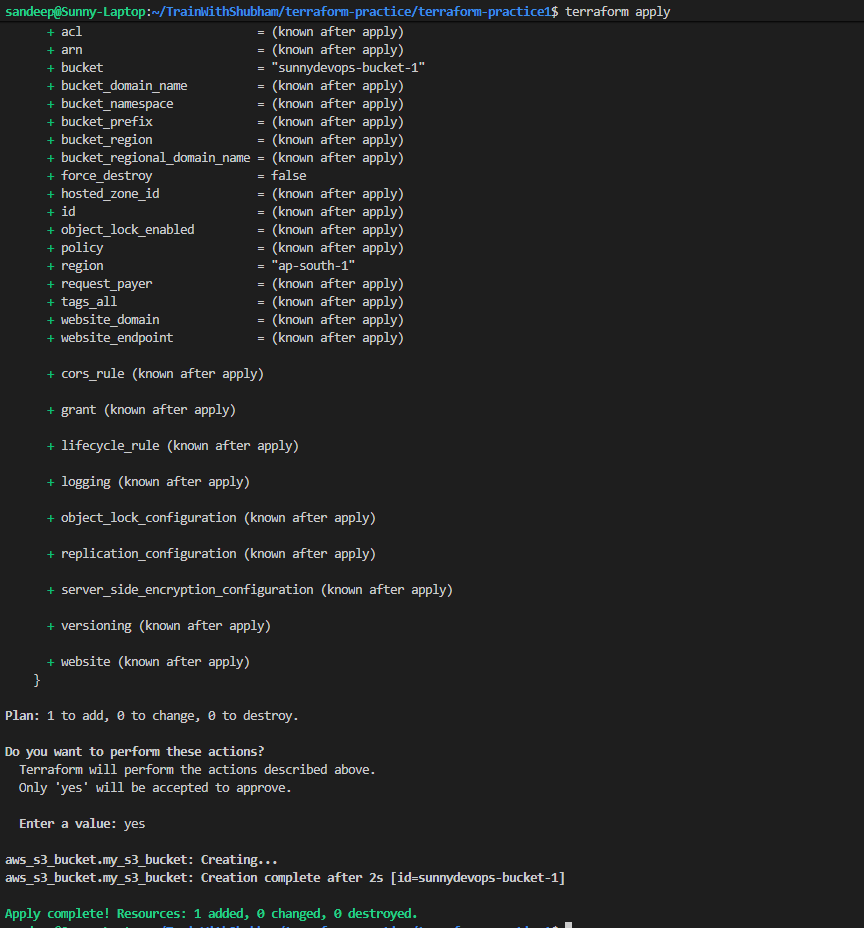
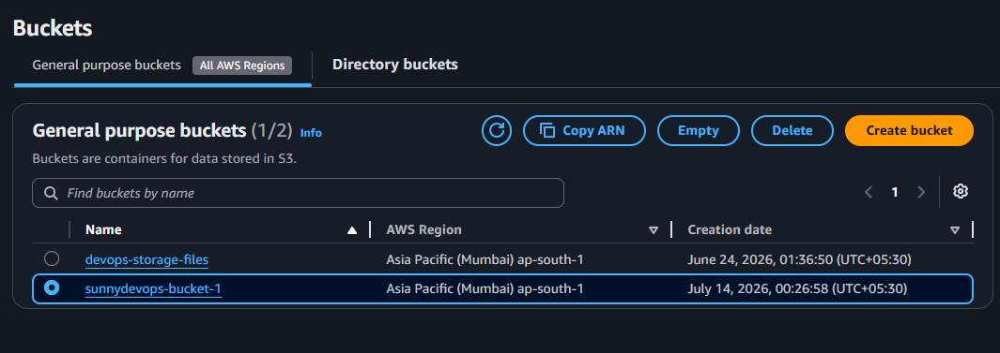
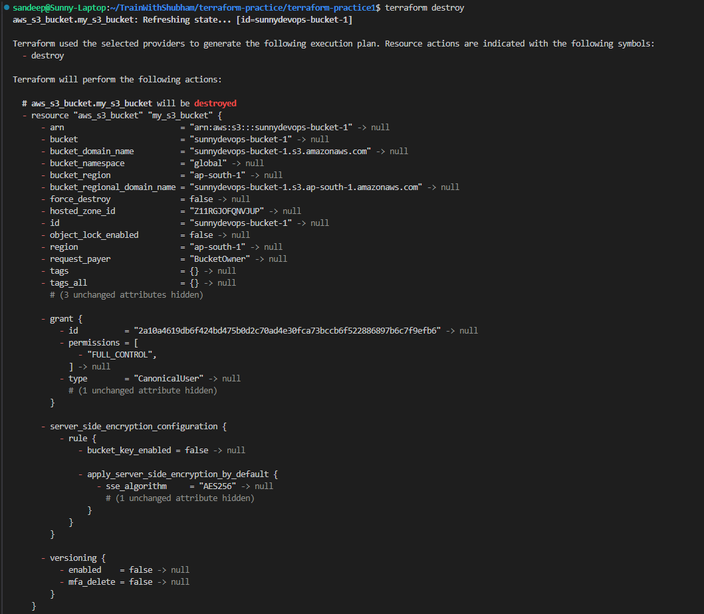

# TerraWeek Day 1 – My Learning Notes

**Date:** 13 July 2026

## Task 1 – Understanding IaC & Terraform

### What is Infrastructure as Code (IaC)?
Infrastructure as Code (IaC) is the practice of defining infrastructure using code instead of manually creating resources through a cloud console. This makes infrastructure repeatable, version-controlled, and easier to maintain across different environments. It also reduces human errors and saves time.

### What is Terraform?
Terraform is an open-source Infrastructure as Code tool developed by HashiCorp. It uses a declarative approach where you describe the desired infrastructure, and Terraform figures out the steps needed to reach that state. It supports multiple cloud providers and services through providers, making it one of the most widely used IaC tools.

### Terraform vs Alternatives

| Tool | Comparison |
|------|------------|
| Terraform | Multi-cloud, declarative, huge provider ecosystem. |
| OpenTofu | Community-driven open-source fork of Terraform with similar syntax. |
| Pulumi | Uses programming languages like Python, Go, and TypeScript instead of HCL. |
| CloudFormation | AWS-native IaC service, best suited for AWS-only environments. |
| Ansible | Primarily a configuration management tool, though it can provision infrastructure as well. |

---

## Task 2 – Terraform Installation

### Commands Used

```bash
terraform version
```


---

## Task 3 – Six Important Terraform Terms

### 1. Provider
A plugin that allows Terraform to communicate with external platforms such as AWS, Azure, Docker, or Kubernetes.

**Example**
```hcl
provider "aws" {
  region = "ap-south-1"
}
```

### 2. Resource
A resource represents an infrastructure component managed by Terraform.

**Example**
```hcl
resource "aws_s3_bucket" "my_s3_bucket" {}
```

### 3. State
The state file keeps track of the infrastructure Terraform manages and helps determine what changes are required.

### 4. Plan
`terraform plan` previews the changes before they are actually applied.

### 5. HCL
HashiCorp Configuration Language (HCL) is the language used to write Terraform configuration files.

### 6. Module
A module is a reusable collection of Terraform configuration files that helps organize and reuse infrastructure code.

---

## Task 4 – First Terraform Workflow

The standard Terraform workflow is:

```text
Write Configuration
        ↓
terraform init
        ↓
terraform fmt
        ↓
terraform validate
        ↓
terraform plan
        ↓
terraform apply
        ↓
Verify Resources
        ↓
terraform destroy
```

### Commands Executed

```bash
cd terraform-practice1
terraform init
terraform fmt
terraform validate
terraform plan
terraform apply
terraform destroy
```












---

## Key Takeaways

- IaC makes infrastructure reproducible and easy to maintain.
- Terraform follows a declarative approach.
- Providers allow Terraform to interact with different platforms.
- State is essential for tracking managed resources.
- `terraform plan` helps avoid accidental changes.
- Modules improve code reusability and organization.

---

## Bonus

### Terraform Autocomplete

```bash
terraform -install-autocomplete
```

### About `.terraform.lock.hcl`

This file locks provider versions so that everyone working on the project uses the same provider versions, ensuring consistent and predictable deployments.

### OpenTofu

OpenTofu is an open-source fork of Terraform that maintains compatibility with most existing Terraform configurations while remaining community governed.

---

## Summary

Today's session helped me understand why Infrastructure as Code has become a core DevOps practice. Instead of manually configuring infrastructure, Terraform allows me to define everything in code, making deployments repeatable, version-controlled, and easier to automate. The concepts of providers, resources, state, and modules now make much more sense, and I'm looking forward to using Terraform with AWS in the upcoming TerraWeek exercises.
